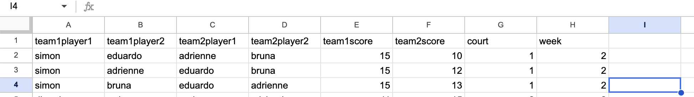

## Instructions

### Setup for new season

1. Create a google sheet with a sheet per level. (This must be done even if there is only one sheet/level)
   - For each level, ensure it is defined in `src/pages/LadderLeague.tsx` in `lvls` (defined on line 31).

2. Define the URLs
   - Go to the google sheet, on the url, copy the text after `/d/` and before `/edit`
   - Copy and paste it and put it in GOOGLE_SHEET_ID in `src/controller/controller.ts`

3. Add games like below. Court and week column can be left blank if not using schedule feature.

4. Once games are added, refresh the website to see live updates.

### Extra

3. To enable schedule, turn `SCHEDULE_FEATURE` in `controller.ts` and set `startingWeekDate` and `lengthOfLeague`

4. To enable profile page, schedule must be turned on, and then turn on `PROFILE_FEATURE` in `controller.ts`.

5. To enable extra details for player name, turn `USE_PLAYER_DATA` and then define `playerData`.

